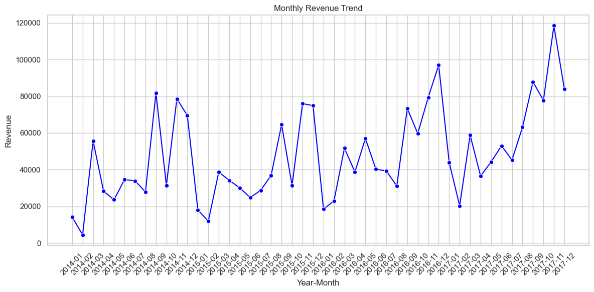

# Superstore Retail Analytics (SQL + Python)
plots/monthly_revenue.png


## Overview

This project analyzes retail sales data using **SQL and Python** to understand revenue trends, product performance, customer behavior, and the impact of discounts on profitability.

The workflow simulates a real-world analytics pipeline where raw transactional data is ingested, cleaned, transformed into a normalized relational schema, and then analyzed using SQL queries and Python visualizations.

Database used: **MySQL (superstore_analytics)**

---

## Dataset

Source: Kaggle – Superstore Dataset

- Total records: 9,994
- Contains transactional retail sales data including:
  - Customer information
  - Orders and shipping details
  - Products and categories
  - Sales, discounts, and profit

The dataset is widely used for **retail analytics and sales performance analysis**.

---

## Data Pipeline

```

Superstore.csv
↓
superstore_raw (staging table)
↓
Data Cleaning & Transformation
↓
Normalized Tables

```

Final tables created:

- **customers** – customer master data
- **orders** – order-level information
- **products** – product catalog
- **order_items** – transaction-level sales data

This structure enables efficient analytical queries.

---

## Data Processing Steps

- Load raw CSV into `superstore_raw`
- Clean and standardize data fields
- Remove duplicates
- Normalize data into relational tables
- Create table relationships
- Run validation checks for data integrity

---

## SQL Analytics

Key analyses performed:

- Monthly revenue trend and month-over-month growth
- Revenue and profit by region
- Category and sub-category sales contribution
- Top products by revenue
- Discount distribution analysis
- Customer lifetime revenue
- Market basket analysis (products frequently bought together)

SQL techniques used:

- Joins
- Aggregations
- Window functions
- CTEs
- Self joins
- Analytical percentage calculations

---

## Python Analysis & Visualizations

Python was used for exploratory analysis and visualization.

Notebooks:

- **01_data_loading.ipynb** – Loads data from MySQL into pandas DataFrames
- **02_analysis_visualization.ipynb** – Performs analysis and creates visualizations

Libraries used:

- Pandas
- NumPy
- Matplotlib
- Seaborn

---

## Visualizations

Visualizations generated during analysis include:

- Monthly Revenue Trend
- Category & Sub-Category Revenue
- Discount vs Profit Relationship
- Revenue Distribution per Customer
- Customer Order Frequency
- Product Pair Analysis

All visual outputs are stored in the **plots/** folder.

---

## Key Insights

- A small number of product categories contribute a large share of total revenue.
- Higher discount levels often correlate with reduced profit margins.
- Revenue distribution shows many low-value purchases and a smaller number of high-value transactions.
- Customer purchasing patterns indicate that a small segment of customers generates a significant portion of sales.

---

## Technologies Used

- MySQL
- SQL
- Python
- Pandas
- NumPy
- Matplotlib
- Seaborn
- Jupyter Notebook

---

## Project Structure

```

superstore-retail-analytics
│
├── data
│ └── Superstore.csv
│
├── sql
│ ├── 01_schema_design.sql
│ ├── 02_data_loading.sql
│ ├── 03_data_ingestion_and_cleaning.sql
│ ├── 04_validation_checks.sql
│ └── 05_kpi_analysis.sql
│
├── python
│ ├── 01_data_loading.ipynb
│ └── 02_analysis_visualization.ipynb
│
├── plots
│ ├── monthly_revenue.png
│ ├── category_revenue.png
│ ├── discount_vs_profit.png
│ ├── revenue_distribution.png
│ ├── product_pairs_heatmap.png
│ └── customer_order_frequency.png
│
└── README.md

```
---

## Objective

The objective of this project is to demonstrate how **SQL-based data modeling and analytics can be combined with Python visualization to extract meaningful insights from retail sales data and support data-driven decision making.**

```